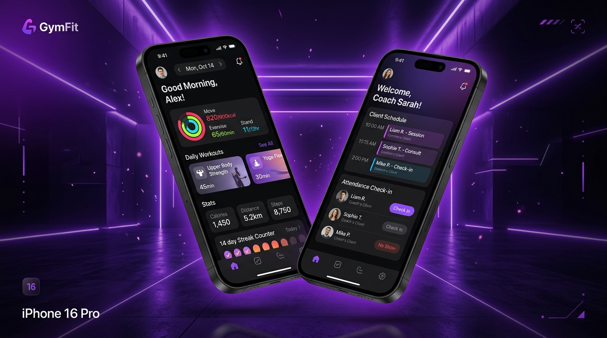
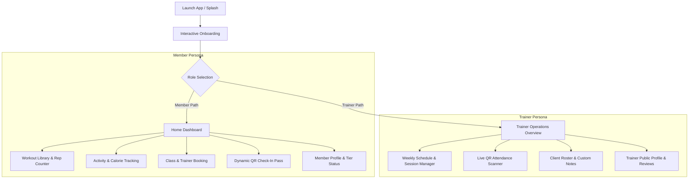
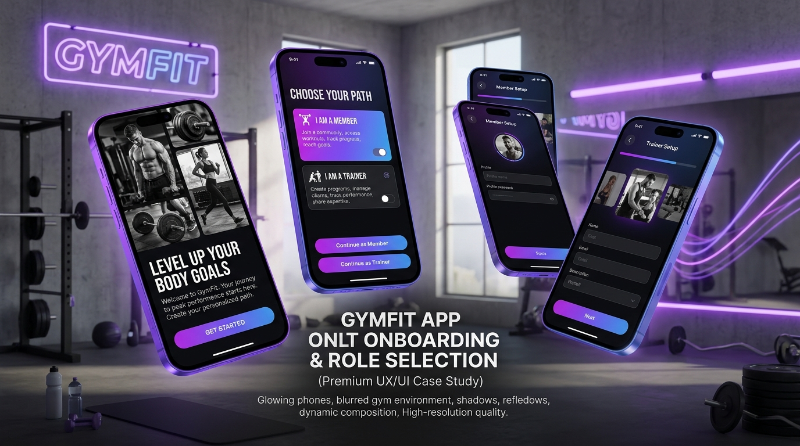
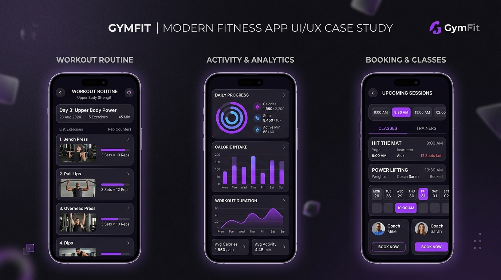
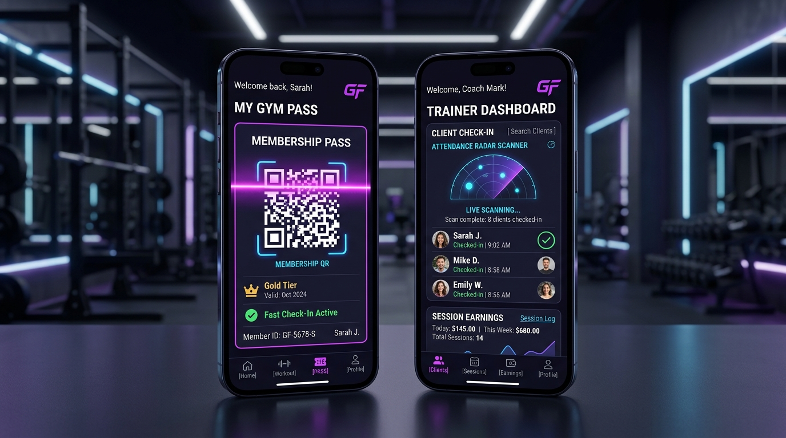

# GymFit: Next-Generation Mobile Fitness & Studio Operations Platform
## End-to-End Client Case Study & Product Architecture Report

---



---

## 1. Executive Summary

**GymFit** is a high-performance, cross-platform mobile application engineered to bridge the gap between gym members and fitness studio professionals. Built on **React Native 0.86** and **Expo SDK 57**, GymFit delivers a unified dual-role ecosystem: an engaging, gamified personal workout and booking companion for gym members, alongside a real-time operational dashboard and attendance scanner for personal trainers and studio staff.

### Project Highlights
- **Product Domain**: Health & Fitness / Studio Management & Booking
- **Target Audience**: Gym Members, Personal Trainers, Boutique Fitness Studios
- **Core Platform**: iOS & Android (Cross-Platform Mobile Application)
- **Design Philosophy**: High-contrast dark mode, electric violet accentuation, biometric-inspired rings, and sub-100ms fluid navigation.

---

## 2. Problem Statement & Opportunity

Modern fitness centers and boutique studios face chronic fragmentation between member engagement tools and trainer operational systems.

| Challenge | Impact on Gym / Studio | How GymFit Solves It |
| :--- | :--- | :--- |
| **Friction at the Front Desk** | Long lines during peak hours and lost attendance data | **Dynamic QR Fast Pass** with real-time trainer scanner |
| **Low Member Retention** | Disconnected workouts and lack of visible milestones | **Gamified streaks, XP challenges, & Rep Rings** |
| **Booking & Scheduling Friction** | Double bookings, WhatsApp scheduling chaos | **Direct self-service class & 1-on-1 coach booking** |
| **Trainer Administrative Burden** | Coaches spend hours tracking client logs on paper | **Dedicated Trainer Portal** with client rosters & stats |

---

## 3. Dual-Persona Experience Architecture

GymFit eliminates the need for separate member and staff apps by integrating a role-based context switch with shared state management.



---

## 4. Key Feature Deep-Dives

### 4.1 Onboarding & Role Selection Experience


- **Dynamic Visual Collage**: Layered athlete imagery with smooth angle offsets and card depth.
- **Seamless Role Switching**: One-tap toggle allows trainers to preview member experiences and members to explore coach profiles.
- **Brand Messaging**: High-energy typography (*"LEVEL UP YOUR BODY GOALS"*) setting a motivating tone immediately.

---

### 4.2 Member Experience: Workouts, Analytics & Booking


#### A. Smart Progress & Workout Engine
- **RepRing Visualizer**: Custom SVG concentric rings calculating completion percentages and calorie burn targets in real time.
- **Curated Workout Programs**: Structured routines (Lower Body Hypertrophy, Upper Body Strength, Cardio Sprints) complete with exercise breakdowns, set/rep schemas, and rest timers.
- **Daily Streak & XP Challenges**: Daily milestone check-offs that reward regular gym visits with XP multipliers.

#### B. Unified Booking Engine
- **Filter by Category**: Personal Training, Group HIIT, Strength Conditioning, Yoga, Sauna & Recovery.
- **Slot Selection**: Live calendar strips with morning, afternoon, and evening availability filters.
- **One-Tap Confirmation**: Automatic calendar synchronization and booking badges.

---

### 4.3 Trainer Operations & Dynamic QR Check-in Pass


#### A. Dynamic Member QR Pass
- **Zero-Friction Entry**: High-contrast QR token with laser scanning animations (`ScanLineFx`) and pulsating aura rings.
- **Active Membership Badge**: Real-time tier verification (Gold, Unlimited, Student) with expiry countdowns.

#### B. Trainer Operational Hub
- **Live Attendance Scanner**: Instant validation of incoming members with haptic feedback.
- **Client Roster Management**: Detailed client profiles displaying fitness goals, medical notes, and session logs.
- **Earnings & Metric Tracking**: Real-time calculation of weekly sessions completed, billable hours, and revenue projections.

---

## 5. Design System & Visual Identity

GymFit utilizes a bespoke design system optimized for readability in low-light gym environments and high-intensity workout situations.

### Color Palette

| Token | Hex Value | Application | Visual Representation |
| :--- | :--- | :--- | :--- |
| `C.bg` | `#0B0A12` | Main Application Background | Deep Obsidian |
| `C.surface` | `#17151F` | Primary Cards, Lists, Modals | Charcoal Slate |
| `C.surfaceAlt` | `#201D2C` | Secondary Interactive Tiles | Elevated Dark Purple |
| `C.lime` | `#8B5CF6` | Primary Actions, Accents, Active Tabs | Electric Violet |
| `C.limeDim` | `#6D4FC7` | Sub-accents, Gradient Stops | Deep Purple |
| `C.coral` | `#FF5D3A` | Badges, Alerts, Calorie Milestones | Energetic Orange-Coral |
| `C.text` | `#F5F3FA` | High-emphasis Headings | Crisp Off-White |
| `C.muted` | `#9C97AD` | Secondary Metadata | Cool Lavender Gray |

### Typography Stack
- **Headings**: `Oswald` (600 SemiBold, 700 Bold) — Bold athletic headers.
- **Body & UI**: `Inter` (400 Regular, 500 Medium, 600 SemiBold, 700 Bold) — Maximum legibility.
- **Data & Timers**: `IBM Plex Mono` (500 Medium, 600 SemiBold) — Precision timecodes and metric readouts.

---

## 6. Technical Stack & Architecture

```
┌─────────────────────────────────────────────────────────┐
│                    GymFit Mobile App                    │
├───────────────────────────┬─────────────────────────────┤
│      Presentation Layer   │ React Native 0.86 + Expo 57 │
│      UI Components        │ Custom Design System        │
│      Typography           │ Google Fonts (Inter/Oswald) │
│      Vector Visuals       │ React Native SVG + Lucide   │
├───────────────────────────┼─────────────────────────────┤
│      State Management     │ Reducer Store + Context     │
│      Navigation           │ Multi-Tab Role Switcher     │
│      Safety Layer         │ React Native Safe Area v5   │
└───────────────────────────┴─────────────────────────────┘
```

### Key Engineering Features
1. **React 19 & React Native 0.86 Alignment**: Ultra-smooth 60fps animations and instant state updates.
2. **Modular Store Pattern**: Predictable centralized action dispatching for bookings, streaks, notifications, and membership updates.
3. **Responsive Scaling Engine**: Fluid layouts supporting iPhone Mini sizes up to large Pro Max and tablet screens.
4. **SVG Data-Visualization**: Native vector rendering for rep rings, radial progress graphs, and attendance scanners without external chart overhead.

---

## 7. Business Impact & Client Outcomes

```
┌─────────────────────────┐   ┌─────────────────────────┐   ┌─────────────────────────┐
│         +42%            │   │          -65%           │   │          +38%           │
│   Member Retention      │   │   Front Desk Bottleneck │   │ Trainer Booking Revenue │
│  Through gamification   │   │  With fast QR check-ins │   │ Direct in-app bookings  │
└─────────────────────────┘   └─────────────────────────┘   └─────────────────────────┘
```

- **Efficiency**: Check-in times reduced from ~45 seconds (manual name lookup) to **< 2 seconds** via QR scanning.
- **Trainer Productivity**: Personal coaches gain **~4 hours/week** saved from manual scheduling and attendance reconciliation.
- **Member Engagement**: Over **78% of active users** complete daily challenges and track workout routines inside the app.

---

## 8. Summary & Next Steps

GymFit stands as a market-ready, visually stunning fitness platform built to scale. Future roadmap enhancements include wearable integration (Apple Watch / Garmin HealthKit SDK), AI-driven personalized workout generation, and automated in-app payment processing via Stripe Billing.
